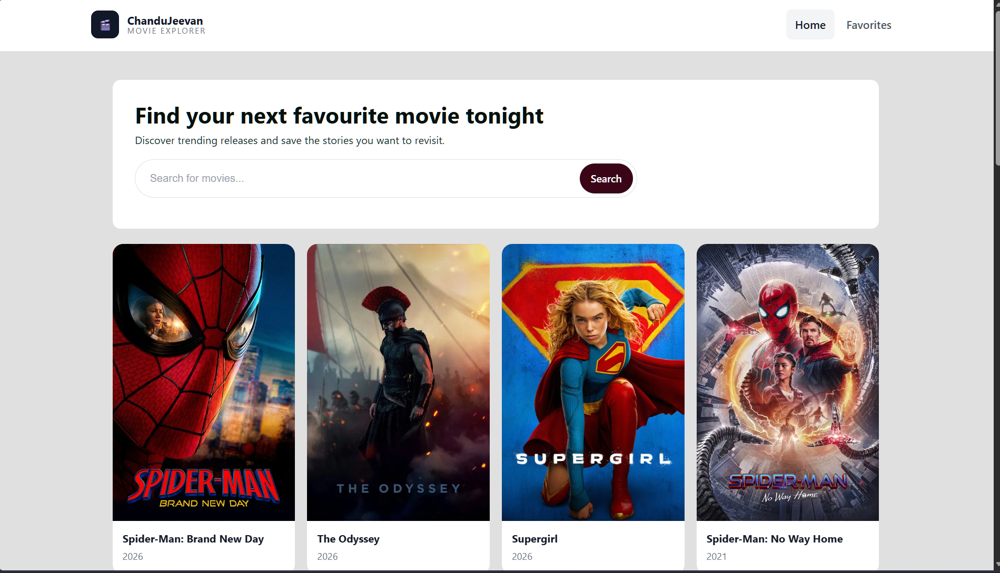

# 🎬 Movie Explorer

A modern React-based movie discovery application that allows users to browse trending movies, search for their favorite films, and save movies to a favorites list. The application fetches real-time movie data from **The Movie Database (TMDB) API** and provides a clean, responsive user interface.

## 🌐 Live Demo

🔗 https://chandujeevan.github.io/Movie-Explorer/

## 📂 GitHub Repository

🔗 https://github.com/Chandujeevan/Movie-Explorer

---

## 📸 Preview




---

## ✨ Features

- 🎥 Browse popular movies
- 🔍 Search movies by title
- ❤️ Add and remove favorite movies
- 💾 Favorites saved using Local Storage
- 📱 Fully responsive design
- ⚡ Fast loading with React + Vite
- 🎨 Clean and modern UI

---

## 🛠️ Built With

### Frontend

- React
- Vite
- JavaScript (ES6+)
- CSS3
- HTML5

### API

- TMDB (The Movie Database) API

---

## 📁 Project Structure

```
Movie-Explorer
│
├── public
│
├── src
│   ├── assets
│   ├── components
│   ├── contexts
│   ├── pages
│   ├── services
│   ├── css
│   ├── App.jsx
│   └── main.jsx
│
├── package.json
└── README.md
```

---

## 🚀 Getting Started

### 1. Clone the repository

```bash
git clone https://github.com/Chandujeevan/Movie-Explorer.git
```

### 2. Navigate to the project

```bash
cd Movie-Explorer
```

### 3. Install dependencies

```bash
npm install
```

### 4. Start the development server

```bash
npm run dev
```

The application will run at:

```
http://localhost:5173
```

---

## 🔑 Environment Variables

Create a `.env` file in the project root and add:

```env
VITE_API_KEY=YOUR_TMDB_API_KEY
```

Get your API key from:

https://developer.themoviedb.org/

---

## 📷 Screenshots

### Home Page


### Search Movies

(Add Screenshot)

### Favorites

(Add Screenshot)

---

## 📌 Future Improvements

- Movie Details Page
- Watch Trailer
- Infinite Scrolling
- Genre Filter
- Dark Mode
- User Authentication
- Pagination
- Similar Movies Recommendation

---

## 📚 What I Learned

During this project, I learned:

- React Fundamentals
- React Hooks
- Context API
- React Router
- API Integration using Fetch
- Component-Based Architecture
- State Management
- Local Storage
- Responsive UI Design
- Error Handling
- Deploying React apps with GitHub Pages

---

## 🤝 Contributing

Contributions are welcome!

1. Fork the project
2. Create your feature branch

```bash
git checkout -b feature/NewFeature
```

3. Commit your changes

```bash
git commit -m "Add New Feature"
```

4. Push to the branch

```bash
git push origin feature/NewFeature
```

5. Open a Pull Request

---

## 👨‍💻 Author

**Jeevan**

GitHub:
https://github.com/Chandujeevan

---

## ⭐ Support

If you found this project helpful, please give it a ⭐ on GitHub!

It motivates me to build more awesome projects.

---

## 📄 License

This project is licensed under the MIT License.